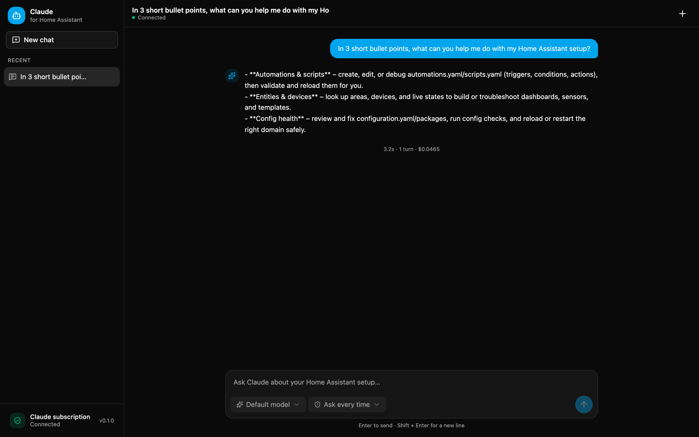

# Claude for Home Assistant

A Home Assistant app that puts a **Claude chat** right in your Home Assistant
sidebar. Ask Claude to read your entities, explain and write automations, check
your YAML for errors, and safely edit your configuration — all from a native
panel, powered by the [Claude Agent SDK](https://code.claude.com/docs/en/agent-sdk).



> Claude runs against your real `/config` directory with the same file tools as
> Claude Code, plus a set of Home Assistant tools. It asks before it changes
> anything, refuses to read your secrets, and takes a git checkpoint before its
> first edit so you can always roll back.

---

## Features

- **Chat UI in the sidebar** — a polished, mobile-friendly chat (built with
  [shadcn-vue](https://www.shadcn-vue.com/)) served through Home Assistant
  ingress. No extra ports, no external hosting.
- **Reads and edits your config** — Claude can open, search, and edit the files
  in `/config`, and validate the result before you reload.
- **Home Assistant aware** — dedicated tools for entity states, services,
  areas/devices, logs, templates, config checks, reloads, and a guarded Core
  restart.
- **Permission modes** — choose *Ask every time*, *Auto-approve edits*, or
  *Plan only* per chat. Writes always ask unless you allow them.
- **Model picker** — switch between the models your subscription offers
  (Sonnet, Opus, Haiku, …) per chat.
- **Interactive questions** — when Claude needs to choose between options, it
  asks with a step-by-step multiple-choice card instead of a wall of text.
- **Safety built in** — a secrets guard, a mandatory config check before
  reload/restart, a git checkpoint before the first edit, and a redacted audit
  log.
- **Persistent, resumable chats** — sessions survive app restarts.

---

## Requirements

- Home Assistant OS or Supervised (the app runs under the Supervisor).
- A **Claude subscription** (Pro, Max, Team, or Enterprise) for the default
  sign-in method, or an Anthropic **API key** if you prefer usage-based billing.

---

## Installation

1. In Home Assistant, go to **Settings → Apps → App Store**.
2. Open the **⋮** menu (top right) → **Repositories**, and add:

   ```
   https://github.com/tormjens/hassio-claude-code
   ```

3. Find **Claude for Home Assistant** in the store and click **Install**.
4. Configure authentication (below), then **Start** the app and open it from
   the sidebar.

---

## Authentication

The app supports two methods, chosen with the `auth_method` option.

### Subscription (recommended)

Sign in with your Claude subscription using a long-lived token, so no
usage-billed API key is stored.

1. On any computer with [Claude Code](https://code.claude.com/) installed and
   signed in to your Claude account, run:

   ```bash
   claude setup-token
   ```

2. Approve the browser login. It prints a token that is valid for about a year.
3. In the app **Configuration** tab, set `auth_method: oauth` and paste the
   token into `oauth_token`, then restart the app.

### API key (alternative)

1. Create a key in the [Claude Console](https://platform.claude.com/).
2. Set `auth_method: api_key` and paste it into `anthropic_api_key`, then
   restart. Usage is billed to your Anthropic account.

---

## Configuration

| Option                        | Default  | Description                                                                                                   |
| ----------------------------- | -------- | ------------------------------------------------------------------------------------------------------------- |
| `auth_method`                 | `oauth`  | `oauth` (subscription token) or `api_key` (static key).                                                        |
| `oauth_token`                 | —        | Token from `claude setup-token`. Used when `auth_method: oauth`.                                               |
| `anthropic_api_key`           | —        | Anthropic API key. Used when `auth_method: api_key`.                                                           |
| `model`                       | —        | Optional default model id or alias (e.g. `opus`, `sonnet`). Leave empty for the account default; switchable per chat in the UI. |
| `anthropic_base_url`          | —        | Optional. Route requests through an Anthropic-compatible gateway.                                              |
| `log_level`                   | `info`   | `debug`, `info`, `warning`, or `error`.                                                                        |
| `auto_approve_readonly_tools` | `true`   | Run read-only Home Assistant tools (states, services, areas, logs, templates) without a permission prompt.     |

---

## Using it

Type a request in the chat. For example:

- "List all my lights and which ones are on."
- "Create an automation that turns off all lights at 23:00 and check the config."
- "Why isn't my `binary_sensor.front_door` automation firing? Read the logs."

**Permission modes** (bottom-left of the composer):

- **Ask every time** — Claude asks before every write, service call, reload, or
  restart.
- **Auto-approve edits** — file edits run without asking; Home Assistant writes
  (service calls, reloads, restarts) still ask.
- **Plan only** — Claude plans without touching anything.

Read-only Home Assistant lookups run without prompting (toggle with
`auto_approve_readonly_tools`).

### What Claude can do

Alongside the standard Claude Code file tools (read, edit, search, run
commands), the app exposes Home Assistant tools:

| Tool                   | Purpose                                              |
| ---------------------- | ---------------------------------------------------- |
| `ha_get_states`        | Read entity states (optionally filtered).            |
| `ha_get_services`      | List available services.                             |
| `ha_call_service`      | Call a service (asks first).                          |
| `ha_get_areas_devices` | List areas and devices.                              |
| `ha_list_integrations` | List configured integrations.                        |
| `ha_get_logs`          | Read the Core log.                                   |
| `ha_render_template`   | Render a Jinja template.                             |
| `ha_check_config`      | Validate the configuration.                          |
| `ha_reload`            | Reload YAML config (config check runs first).        |
| `ha_restart_core`      | Restart Home Assistant Core (config check first).    |
| `ha_list_secret_keys`  | List the *names* of keys in `secrets.yaml` (never the values). |

---

## Safety

- **Secrets guard** — reads of `secrets.yaml` and the auth store are blocked;
  Claude can see secret *names* but never their values.
- **Config check before reload/restart** — `ha_reload` and `ha_restart_core`
  run a configuration check first and refuse on failure.
- **Git checkpoint** — before its first edit in a session, the app commits a
  checkpoint of `/config`, so you can revert from the UI.
- **Audit log** — every tool call is recorded (with secrets redacted) under
  `/data`.

---

## Local development

You do not need Home Assistant to work on the app. From the repo root:

```bash
scripts/dev.sh
```

This installs dependencies, creates a throwaway Home Assistant config under
`.dev/`, runs the TypeScript server on `:8099` with hot reload, and the Vite dev
server on `:5173` (which proxies API and WebSocket calls to the server). Open
<http://localhost:5173>.

Provide a credential via a gitignored `.env` in the repo root:

```bash
echo 'CLAUDE_CODE_OAUTH_TOKEN=<token from `claude setup-token`>' >> .env
# or, for API-key mode:
# echo 'ANTHROPIC_API_KEY=sk-ant-...' >> .env
# echo 'CLAUDE_HA_AUTH_METHOD=api_key' >> .env
```

Flags: `--server-only`, `--ui-only`, `--install` (force `npm ci`).

Useful commands:

```bash
cd claude-ha/server && npm test         # server unit tests
cd claude-ha/server && npm run typecheck # server type check
cd claude-ha/ui && npm run build         # build + type-check the UI
```

---

## Building the image

The Supervisor builds the image on install. To build it yourself, from
`claude-ha/`:

```bash
docker build --build-arg BUILD_ARCH=amd64 --build-arg BUILD_VERSION=0.1.0 -t local/claude-ha:dev .
```

The Dockerfile is multi-stage: it builds the UI and compiles the server on the
build host's platform, then assembles the runtime on the official Home Assistant
Alpine base image with the correct native Claude Code binary for the target
architecture (`amd64` and `aarch64`).

---

## How it works

```
Home Assistant ingress
        │
        ▼
  Node server (claude-ha/server)
   ├─ serves the built UI (claude-ha/ui)
   ├─ WebSocket chat protocol
   ├─ one Claude Agent SDK session per chat
   ├─ in-process MCP server with the Home Assistant tools
   └─ PreToolUse hooks: secrets guard, config check, git checkpoint, audit log
        │
        ▼
  Home Assistant Supervisor / Core API   (states, services, config, logs)
```

- `claude-ha/server` — Node 22 + TypeScript backend: the chat protocol, the
  Agent SDK integration, the Home Assistant MCP tools, and the safety hooks.
- `claude-ha/ui` — Vue 3 + Vite + shadcn-vue chat interface. All URLs are
  relative so it works under the ingress prefix.
- `claude-ha/rootfs` — s6-overlay service that starts the server.

See [NOTES.md](NOTES.md) for the design decisions and open questions.

---

## Troubleshooting

- **"Not signed in" banner or chat errors** — no credential is configured.
  Follow [Authentication](#authentication) and restart the app.
- **Home Assistant tools fail** — they only work when the app runs under the
  Supervisor (not in bare local development without a `SUPERVISOR_TOKEN`).
- **Nothing happens on send** — check the app log; set `log_level: debug` for
  detail.

---

## License

MIT
